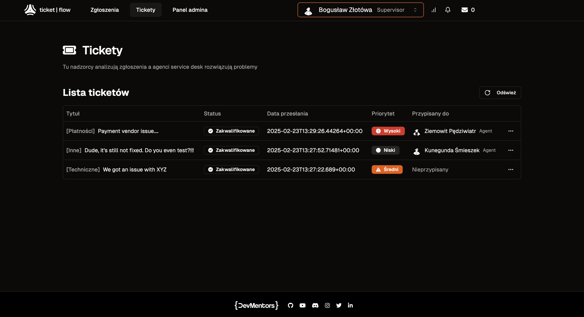

[](https://messaging-pragmatycznie.pl/)

 # Czym jest projekt TicketFlow?
 Ticketflow to **rozproszony** **system ticketowy**, w którym w prosty sposób zespół anglojezyczny jest w stanie obsługiwać zgłoszenia klientów z całego świata. Dodatkowo, by utrzymać SLA wynikające z umów podpisanych z klientami, system (poza wspieraniem procesu obsługi ticketow) wspiera agentów service desk w postaci przypomnień, alertowania czy prezentowania metryk na żywo.

 Cały system został w całości oparty o **komunikację asynchroniczną**, a jego omawianie jest przedmiotem kursu [**Messaging:Pragmatycznie**](https://messaging-pragmatycznie.pl/), w którym poruszamy m.in. tematy:

- RabbitMQ i protokołu AMQP
- Producenta/konsumenta wiadomości
- Topologii komunikacji asynchronicznej
- Deduplikacji wiadomości
- Tranzakcyjnego publikowania wiadomości
- Kolejności przetwarzania wiadomości
- Obsługi błędów
- Azure Service Bus
- Message Streaming (Kafka)
- Testowania integracyjnego

# Topologia systemu TicketFlow
W systemie masz moliwość uruchomienia następujących przypadków użycia:

- dodanie zgłoszenia
- tłumaczenie zgłoszenia
- tworzenie ticketu
- kwalifikacja ticketu
- przypisanie agenta do ticketu
- osbługa przypomnień
- blokowanie/odblokowywanie ticketu
- obliczanie deadline-ów obsługi zgłoszeń
- rozwiązywanie ticketów i komunikacja z klientem

 Na pierwszy rzut oka możesz pomyśleć, że tak mały scope w systemach rozproszonych nie ma sensu. Po co komplikować życie, zamiast umieścić wszystko w monolicie? Powód jest prosty – **rzeczywistość wygląda inaczej**. Większość rozwiązań messagingowych działa właśnie w środowiskach rozproszonych, gdzie niedostępność usług, partycjonowanie sieci czy replikacja dramatycznie wpływają na komunikację asynchroniczną i ujawniają słabości systemu. Dlatego zaprojektowaliśmy ten kurs tak, aby jak najbardziej oddawał realia produkcyjne. Zresztą... patrząc na samą topologię zauważysz, że to zdecydowanie nie będzie prosty system à la "Hello World!" ;)


# Jak uruchomić projekt?

Do uruchomienia wymagany jest **Docker Desktop** lub **Rancher Dektop**!


### Infrastruktura

```bash
sh ./run_infra.sh
```

### Wyczysczenie wszystkich baz danych i topologii RabbitMQ

```bash
 cd ./wipe_and_rebuild_infra.sh
```

### Zbudowanie i wykonanie migracji bazodanowych

```bash
 cd ./src && sh ./run_all_migrations.sh
```

### Uruchomienie wszystkich usług

```bash
 sh ./run_ticketflow.sh
```

### Uruchomienie interfejsu uutkownika

```bash
 cd ./src_frontend && sh ./run_all_fe.sh
```

UI dostępny jest pod adresem `localhost:21000`




# System anomalii
Gdy po raz pierwszy siadaliśmy do budowania listy modułów i rozpisywania lekcji, jedną z głównych rzeczy która wydawała się nam upierdliwa w wykonaniu było płynne i w miarę bezobsługowe pokazanie osobie przechodzącej przez kurs jak na różne problemy w systemie rozproszonym reaguje nasza modelowa aplikacja.

Doszliśmy do wniosku, że skoro budujemy UI do TicketFlow, to powinniśmy także umożliwić Ci odkrywanie, jak system się zachowa, gdy w wybrane miejsce wkradnie się problem.

🧪 Tak też powstał system generowanie anomalii w TicketFlow, o którym [**przeczytasz** **tutaj**](./docs/ANOMALIE.md)!

