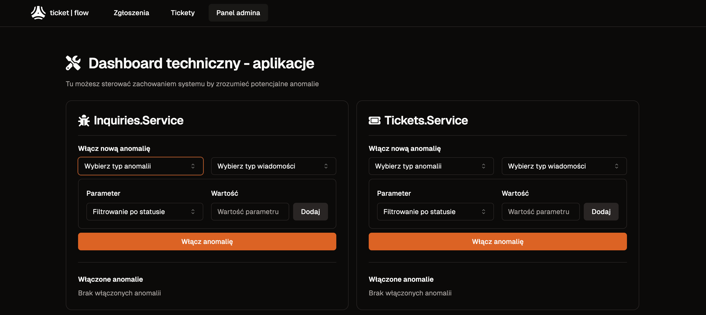
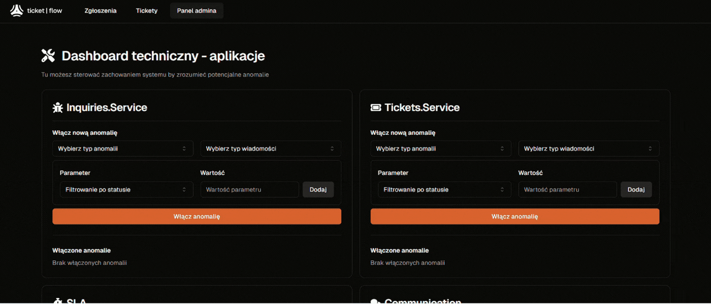
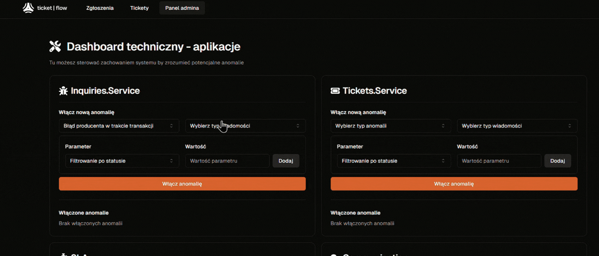
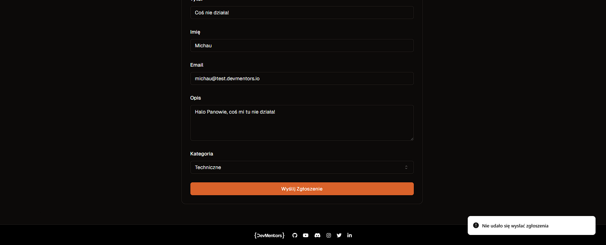

# Anomalie w TicketFlow

Gdy po raz pierwszy siadaliśmy do budowania listy modułów i rozpisywania lekcji, jedną z głównych rzeczy która wydawała się nam upierdliwa w wykonaniu było płynne i w miarę bezobsługowe pokazanie osobie przechodzącej przez kurs jak na różne problemy w systemie rozproszonym reaguje nasza modelowa aplikacja.

Doszliśmy do wniosku, że skoro budujemy UI do TicketFlow, to powinniśmy także umożliwić Ci odkrywanie, jak system się zachowa, gdy w wybrane miejsce wkradnie się problem.

Tak też powstał system generowanie anomalii 🧪 w TicketFlow!

Ale o co tu właściwie chodzi?

Dla każdej z usług, które wchodzą w skład naszej aplikacji TicketFlow możesz wybrać jeden ze zdefiniowanych typów anomalii takich jak opóźnienie czy wyjątek oraz zdecydować w którym momencie publikacji czy konsumpcji komunikatu ma wystąpić:

Żeby to miało sens, do wyboru są również dostępne w systemie komunikaty jak i ew. parametry opóźnienia, tak by można było eksperymentować z pomysłami jak “wysadzić” naszą komunikację asynchroniczną, by potem wykorzystać zdobytą wiedzę z kursu i zaradzić tym problemom:

Albo obserwować jak TicketFlow płonie 🔥

Pewnie teraz myślisz: “Bardzo fajnie, ale właściwie po co to komu? Przecież teoretycznie można wejść w kod i popsuć go samemu/samej w ramach eksperymentu.”

Pełna zgoda, ale! ☝️

🤔 Po pierwsze - założyliśmy, że w ten sposób **nawet osoba nie do końca znająca C# może “pobawić się” zachowaniem systemu** by lepiej zrozumieć - nawet od strony użytkownika końcowego - jakie konsekwencje ma wystąpienie konkretnej anomalii w danym miejscu w systemie. 
Chcesz przerabiając kurs pokazać potencjalny problem np. QA z twojego zespołu? Nic prostszego.

🔍 Po drugie - w kursie przedstawiamy - w myśl architektury **pipes and filters** - sposób rozszerzania zarówno pipeline’u producenta i konsumenta. Dlaczego by nie pokazać jeszcze jednego mechanizmu, który wpisuje się w tę ideę?

🧠 Po trzecie - skoro to kurs opierający się o RabbitMQ, dlaczego by nie pokazać **kolejnego przypadku użycia, który opiera się o komunikację asynchroniczną**? Generator anomalii bowiem nie tylko potrafi obsłużyć jedną instancję danej usługi, ale i w przypadku wielu uruchomionych instancji danego serwisu będzie - przy użyciu **kolejek tymczasowych** - synchronizował stan pomiędzy nimi.
Masz podobny case? Zobacz jak +/- taki flow mógłby wyglądać.